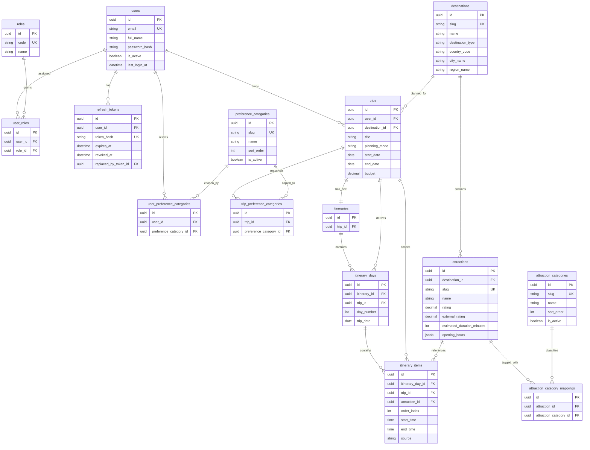

# Stoury API Database Relations

This document is the visual companion to [schema.md](schema.md). Open it in GitHub, Codex, or any Mermaid-capable markdown viewer to render the ERD.

## ERD

## Reading guide

- `users`, `roles`, `user_roles`, and `refresh_tokens` form the auth and access-control area.
- `preference_categories`, `user_preference_categories`, and `trip_preference_categories` separate profile preferences from trip snapshots.
- `destinations`, `attractions`, `attraction_categories`, and `attraction_category_mappings` define the curated travel catalog.
- `trips`, `itineraries`, `itinerary_days`, and `itinerary_items` define trip planning and saved itinerary structure.

## Important relational rules

- One user can have many trips, but overlapping trips to the same destination are rejected at the database level.
- A trip has at most one itinerary.
- Itinerary items can only reference attractions that belong to the trip destination.
- The same attraction cannot appear twice in the same trip.
- Trip preferences are copied into trip-owned rows and do not point dynamically at future user preference changes.
