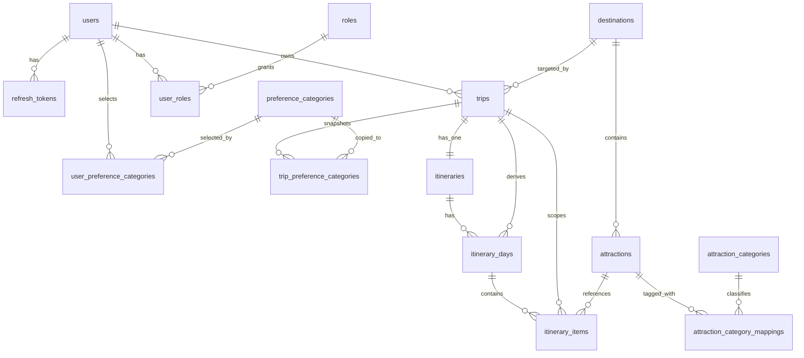

# Stoury API Schema Summary

## Naming and conventions

- Database tables use `snake_case` singular/plural names exactly as created by migrations.
- Primary keys are UUIDs generated in PostgreSQL with `gen_random_uuid()`.
- All tables use `created_at` and `updated_at`.
- Sequelize models use camelCase attributes with `underscored: true`.

## ERD

For a larger visual with table fields and foreign-key labels, see [database-relations.md](database-relations.md).

## Table purpose

- `users`: authenticated travelers, password hash, status, and last login metadata.
- `roles`: normalized role catalog for future admin support.
- `user_roles`: many-to-many join between users and roles.
- `refresh_tokens`: persisted refresh token records with rotation metadata.
- `preference_categories`: seed-owned user/trip preference options.
- `user_preference_categories`: current profile preference selections per user.
- `trip_preference_categories`: trip-owned preference snapshots copied at trip creation.
- `destinations`: curated city/region destinations with hero image support and flexible location columns.
- `attractions`: curated attractions with geolocation, duration, opening-hours JSON, final public image fields, provider enrichment fields, and enrichment workflow state.
- `attraction_categories`: seed-owned attraction taxonomy separate from preference categories.
- `attraction_category_mappings`: many-to-many join between attractions and attraction categories.
- `trips`: core trip record with destination, planning mode, date range, and budget.
- `itineraries`: one-to-one shell table for a trip itinerary.
- `itinerary_days`: itinerary day rows with derived `trip_id` and `trip_date`.
- `itinerary_items`: ordered attraction stops per day with source flag and optional time window.

## Database-enforced rules

- `users.email`, `destinations.slug`, `attractions.slug`, and role/category slugs are unique.
- Refresh tokens are persisted and unique by `token_hash`.
- The initial migration enables `pgcrypto` and `btree_gist` before creating UUID defaults and the trip overlap exclusion constraint.
- Same user cannot have overlapping trips for the same destination via a PostgreSQL exclusion constraint.
- Trip dates must satisfy `start_date <= end_date`.
- Attraction numeric fields are range-checked.
- Attraction enrichment status is restricted to `pending`, `enriched`, `needs_review`, or `failed`.
- Attraction provider records are unique by `(external_source, external_place_id)` when both values are present.
- Owned attraction asset provenance for v1 lives in `attractions.metadata.assetSource`; no separate gallery/source table exists yet.
- Itinerary day numbers must be positive and within the trip date range.
- Itinerary days are forced to stay sequential starting at `1` by a deferred constraint trigger.
- Itinerary items are unique per `(trip_id, attraction_id)`, preventing the same attraction from appearing twice in one trip.
- Itinerary items are unique per `(itinerary_day_id, order_index)`.
- Itinerary item triggers reject attractions that do not belong to the trip destination.

## Attraction enrichment fields

- `external_source`: normalized provider identifier for enrichment, such as `google_places`.
- `external_place_id`: provider-owned stable place identifier used to deduplicate saved enrichments.
- `external_rating`: provider rating snapshot kept separate from the curated `rating` field.
- `external_review_count`: provider review-count snapshot used for admin review and ranking context.
- `external_last_synced_at`: last successful provider sync timestamp for refresh/staleness queries.
- `enrichment_status`: internal workflow state for the attraction enrichment process.
- `enrichment_error`: last non-sensitive lookup failure summary for admin troubleshooting.
- `enrichment_attempted_at`: timestamp of the last enrichment attempt, successful or not.

`enrichment_status` meanings:

- `pending`: no provider match has been saved yet.
- `enriched`: a provider match has been accepted and the normalized fields are populated.
- `needs_review`: a provider lookup returned an ambiguous result that should not be auto-saved.
- `failed`: the last provider lookup attempt failed and may need a retry.

Intentionally not stored for MVP:

- raw Google or provider response payloads
- alternate candidate lists from provider searches
- provider-owned descriptions, photos, or editorial content as source-of-truth replacements for curated catalog fields

## Seeded catalog

- Roles: `user`, `admin`
- Preference categories: 8 options
- Attraction categories: 10 options
- Destinations: Batam, Yogyakarta, Bali
- Attractions: 72 curated entries across the three destinations
- QA user seed: 1 non-production bootstrap user with the default `user` role
- Admin user seed: 1 bootstrap user with `user` and `admin` roles in development/test, or in production when `SEED_DEFAULT_ADMIN_USER=true`

## Assumptions left open by product decisions

- Refresh tokens are stored in the database as hashed records to support logout and future rotation workflows.
- Role support is normalized with `roles` and `user_roles` instead of a single enum column on `users`.
- Trips to different destinations may overlap; only same-user plus same-destination overlap is rejected.
- Attraction slugs are globally unique, not merely unique within a destination.
- `budget` is stored as a numeric amount without a separate currency column for MVP.
- Trip and itinerary business workflows should save full itineraries inside transactions so the deferred sequence trigger can validate the final day set.
